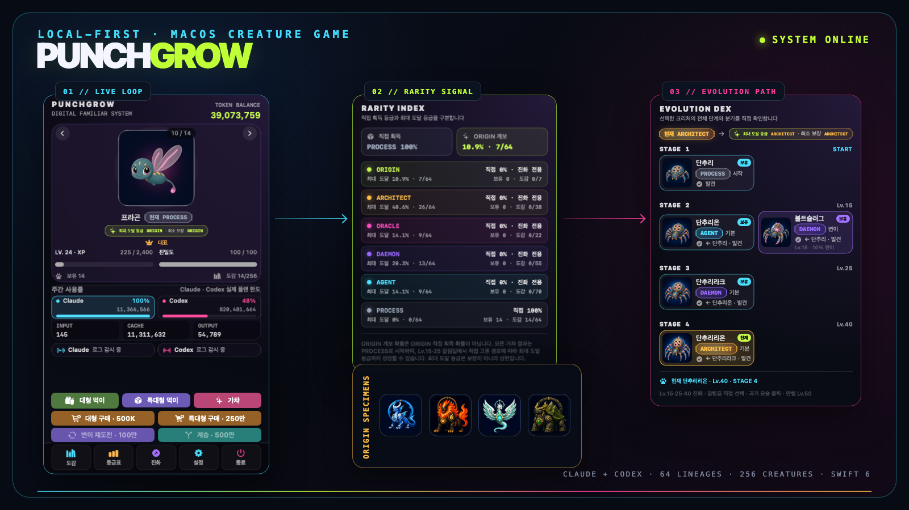
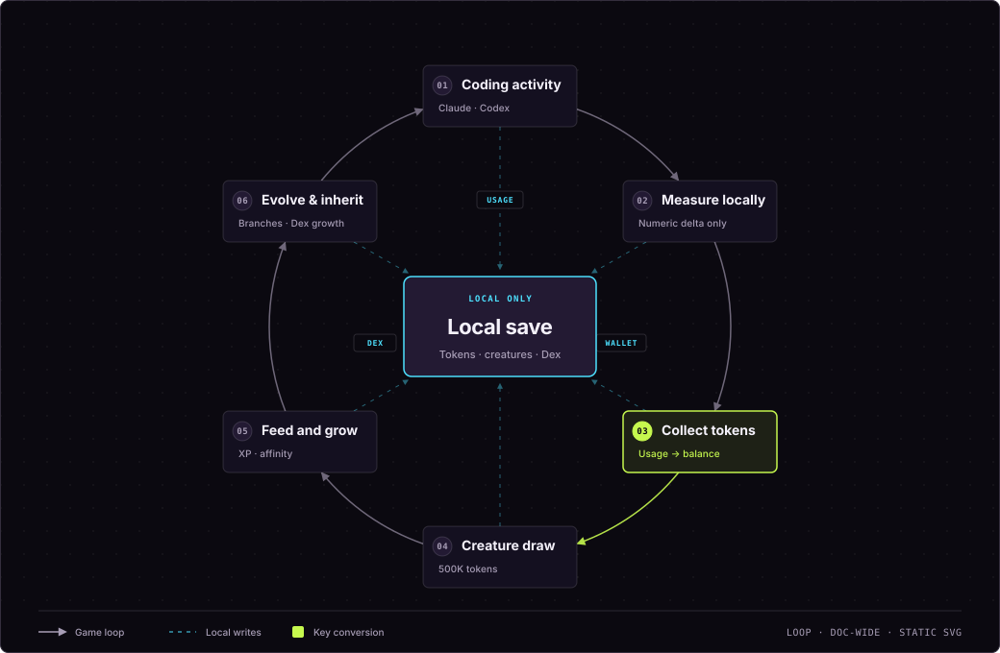
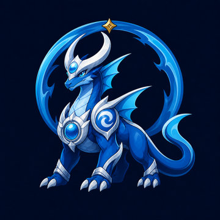
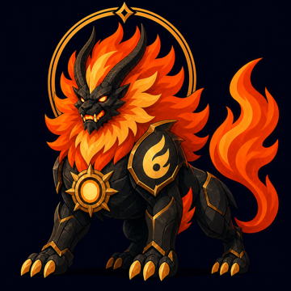
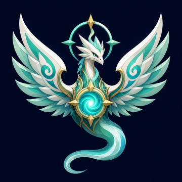
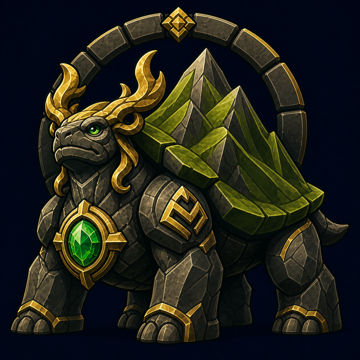

<!-- readme-section:hero -->
<div align="center">
  <h1>PunchGrow</h1>
  <p><strong>The creature game that grows when you code</strong></p>
  <p>A local-first macOS creature game that turns<br />Claude Code and Codex usage into growth energy.</p>

  <p>
    <a href="README.md">한국어</a>
    ·
    <a href="README.en.md"><strong>English</strong></a>
    ·
    <a href="https://punchgrow.thundo.kr/en/">Official website</a>
  </p>

  <p>
    
    
    
    
  </p>

  

  <p>
    <a href="#quick-start"><strong>Install</strong></a>
    ·
    <a href="https://punchgrow.thundo.kr/en/dex/">Live dex</a>
    ·
    <a href="docs/USAGE.en.md">User guide</a>
    ·
    <a href="#privacy">Privacy</a>
    ·
    <a href="docs/PROJECT_STRUCTURE.md#english">Repository map</a>
    ·
    <a href="#contributing">Contribute</a>
  </p>
</div>

---

<!-- readme-section:status -->
## Project status

> [!IMPORTANT]
> **v0.4.0 alpha release.** The intended public scope of this repository is the Apple Silicon macOS 14+ menu-bar app.

| Release v0.4.0 | Current main |
| --- | --- |
| **2026-08-18 Homebrew release**<br />64 starting lineages · 256 creatures · 7 of 64 lineages can reach ORIGIN (about 10.9%)<br />Ad-hoc signed · Developer ID signing and Apple notarization pending | **Current source and public dex**<br />64 starting lineages · 256 creatures · 7 of 64 lineages can reach ORIGIN (about 10.9%)<br />Catalog matches the release |

- **CI:** Full Xcode verifies the Swift test suite, Release build, 256-creature resource assembly, and ad-hoc signature.
- **Website:** [`punchgrow.thundo.kr`](https://punchgrow.thundo.kr/en/) is a static product site and dex deployed from `website/` through GitHub Pages. It has no backend or usage collection.

<!-- readme-section:quick-start -->
<a name="quick-start"></a>
## Quick start

### Install with Homebrew (recommended)

Requirements: Apple Silicon, macOS 14 or newer.

```bash
brew tap yoonsundo/punchgrow https://github.com/yoonsundo/punchgrow
brew trust yoonsundo/punchgrow
brew install --cask punchgrow
xattr -d com.apple.quarantine /Applications/PunchGrow.app
```

> [!NOTE]
> The release is ad-hoc signed and not yet notarized. Before the first launch, run the final `xattr` command above to clear quarantine.
>
> - **Homebrew 6 or newer:** run `brew trust`
> - **Earlier Homebrew versions:** skip `brew trust`
> - **`--no-quarantine`:** removed in Homebrew 6 and no longer supported

The [complete user guide](docs/USAGE.en.md) covers installation, collection states, gameplay, backup, removal, privacy, and troubleshooting with screenshots.

<!-- readme-section:core-loop -->
<a name="core-loop"></a>
## The core experience

**Code → collect tokens → discover creatures → grow and evolve → raise another lineage.** All state remains on your Mac.

<p align="center">
  <a href="docs/diagrams/punchgrow-growth-loop.en.svg">
    
  </a>
  <br />
  <sub>Click the diagram to read the detailed labels at full size.</sub>
</p>

### Why PunchGrow exists

PunchGrow turns numeric token usage into growth energy without collecting prompts or code. The exact collection and storage boundaries follow below.

<!-- readme-section:privacy -->
<a name="privacy"></a>
## Privacy

The macOS app runs locally and collection is off until the user explicitly enables it.

### Local reads

- **Claude Code usage:** discovered from `~/.claude/projects/**/*.jsonl`.
- **Codex usage:** discovered from `~/.codex/sessions/**/*.jsonl`.
- **Claude plan usage:** read from the local cache written by Claude Code. PunchGrow only runs Claude Code's status-line script to keep that cache fresh.
- **Codex plan usage:** read from rate-limit metadata in the logs.
- **Authentication data:** PunchGrow neither reads nor stores authentication tokens.
- **First scan:** establishes a non-crediting baseline; only later increases earn game tokens.

### Local state

- **Stored:** normalized token counts, timestamps, opaque hashes, incremental cursors, and game state.
- **Not stored:** prompts, responses, source code, commands, project names, raw paths, emails, or account/model identifiers.
- **After disconnecting:** deleting the PunchGrow cache does not edit or delete the original Claude Code or Codex logs.

### Network boundary

- **PunchGrow update check:** comparing a public GitHub Releases tag against the installed version is the only network request PunchGrow itself sends. It is unauthenticated and carries no usage numbers or game state.
- **Check cadence:** after success, the next check runs a day later. Failures retry with a backoff from 60 seconds to 24 hours. Turn it off anytime from **Settings > Data & Settings > 업데이트**.
- **Claude status-line refresh:** while collection is enabled, PunchGrow runs Claude Code's status-line script about once a minute. That script queries the provider with its own credentials; PunchGrow never reads them. Turning collection off stops these runs.

See [the macOS documentation](macos/README.md) for the detailed collection and status model.

<!-- readme-section:screens -->
<a name="live-systems"></a>
## Actual app screens

These are captures rendered by the current SwiftUI app. They use fixed documentation sample data and contain no user's private logs, prompts, or source code.

<p align="center">
  
</p>

<table>
  <tr>
    <td align="center"><br /><strong>Rarity index</strong><br /><sub>Direct draw rarity is separate from maximum reachable rarity</sub></td>
    <td align="center"><br /><strong>Evolution Dex</strong><br /><sub>Past, current, and future forms stay distinct; fusion collectibles remain current-form-only</sub></td>
  </tr>
</table>

[Open the complete user guide →](docs/USAGE.en.md)

<!-- readme-section:game-rules -->
<a name="game-engine"></a>
## Game rules

| Rule | Alpha value |
| --- | --- |
| One draw | `500,000` tokens |
| Draw result | One of 64 PROCESS stage-one creatures · PROCESS 100% |
| ORIGIN lineage | 7 of 64 starts · about 10.9% maximum reachable rarity, not a direct ORIGIN pull |
| Normal food | Costs `100,000` tokens · XP `+25` · affinity `+3` |
| Large food | Costs `500,000` tokens · XP `+200` · affinity `+10` |
| Unique color | Independent `0.1%` chance per draw, with no stat advantage |
| Duplicate creatures | Kept as separate individuals that can be raised differently |
| Evolution levels | Level 15 → stage 2 · level 25 → stage 3 · level 40 → stage 4 |
| Evolution fork | Once at each fork · pick one of 2 paths yourself; pauses until you choose |
| Fusion collectibles | The 10 `mixed` species stay outside ordinary evolution; legacy owned fusions remain available as current-form-only collectibles |
| Mutation trigger | `10%` chance at the level-15 evolution · accept ends growth, decline continues to the original selected or automatically determined target |
| Mutation retry | `1,000,000` tokens per attempt · `10%` chance, guaranteed after `30` failures in a lineage |
| Inheritance | `5,000,000` tokens · get a new same-lineage individual from a fully grown creature |
| Maximum level | Level 50. Legacy level 51–100 saves remain valid but cannot grow further |

### Growth and evolution

- **Draws and rarity:** draws never grant a higher-stage evolution directly. Every creature starts as PROCESS and grows through feeding. The UI separates actual `Current <rarity>` from `Maximum reachable rarity <rarity>`—the selectable-path ceiling excluding mutations—and also shows the minimum guaranteed rarity.
- **Evolution forks:** at level 15 or 25, choose one of two directions. Evolution pauses with a badge until you choose, and the choice applies only to that evolution; the next fork asks again.
- **Fusion collectibles:** the 10 `mixed` species combine unrelated families and stay outside ordinary evolution, forks, potential calculations, and Evolution Dex ancestry. Existing saves keep owned fusions safely and show only their actual current form.
- **Mutations:** candidate lineages have a 10% chance to offer a mutation at level 15. Accepting ends growth as a terminal mutant form; declining continues the evolution to the original target selected by the user or automatically determined before the offer. `변이 재도전` (Mutation Retry) costs 1,000,000 tokens at a 10% success rate, with the next attempt guaranteed after 30 failures in the same lineage.
- **Inheritance:** a final-stage creature can spend 5,000,000 tokens to produce a new individual of the same starting species for another fork. An ORIGIN-lineage draw is still a current PROCESS creature; the dedicated reveal requires actually owning an ORIGIN species. A lineage with no next-stage entry keeps its current form and can continue growing.

<!-- readme-section:creatures -->
<a name="creature-signal"></a>
## The creature world

### The four Elemental Origin lineages

Water, fire, wind, and earth each grow through `PROCESS → AGENT → DAEMON → ORIGIN`. They follow the same catalog rules as every other lineage, while their final forms share a primordial sigil that marks them as a special class of ORIGIN.

<table>
  <tr>
    <td align="center"><br /><strong>Nervasil</strong><br /><sub>Water · the first wave that preserves memory</sub></td>
    <td align="center"><br /><strong>Karmag</strong><br /><sub>Fire · the first will that makes possibility real</sub></td>
    <td align="center"><br /><strong>Velaum</strong><br /><sub>Wind · ruler of the paths and the first breath</sub></td>
    <td align="center"><br /><strong>Grandor</strong><br /><sub>Earth · the first foundation that bears the world</sub></td>
  </tr>
</table>

[Browse all four lineages in the English dex →](https://punchgrow.thundo.kr/en/dex/) · [Open the canonical design source (Korean) →](문서/ELEMENTAL_ORIGINS.md)

### Featured creatures

<table>
  <tr>
    <td align="center"><br /><strong>Eilu</strong><br /><sub>PROCESS · PG-001</sub></td>
    <td align="center"><br /><strong>Litonion</strong><br /><sub>AGENT · PG-102</sub></td>
    <td align="center"><br /><strong>Majelonrak</strong><br /><sub>DAEMON · PG-109</sub></td>
  </tr>
  <tr>
    <td align="center"><br /><strong>Quinon</strong><br /><sub>ORACLE · PG-193</sub></td>
    <td align="center"><br /><strong>Jarpenrak</strong><br /><sub>ARCHITECT · PG-166</sub></td>
    <td align="center"><br /><strong>Pityon</strong><br /><sub>ORIGIN · PG-211</sub></td>
  </tr>
</table>

> [!CAUTION]
> The featured creatures and other artwork are covered by the separate [visual asset license](ASSET-LICENSE.md), not MIT.

<!-- readme-section:actual-plan-usage -->
<a name="usage-signal"></a>
## Actual plan usage

The `C n%` and `X n%` values in the menu bar are not token-based estimates.

| Signal | Actual data source |
| --- | --- |
| `C` | Reads Claude's actual weekly percentage from the `~/.claude/plugins/oh-my-claudecode/.usage-cache-anthropic.json` cache. Only Claude Code writes that cache, so PunchGrow runs its status-line script once a minute to keep the value from going stale. It stays pending when the cache is absent. |
| `X` | Reads Codex's actual weekly `used_percent` from session rate-limit metadata. |

- With automatic collection enabled, PunchGrow checks approximately every ten seconds.
- Provider updates automatically reflect both increased usage and weekly resets.
- Missing data is shown as pending instead of inventing a `0%` value.

<!-- readme-section:walkthrough -->
<a name="first-run"></a>
## Five-minute walkthrough

1. Launch PunchGrow and find its creature in the macOS menu bar rather than the Dock.
2. Open the popup, choose `Settings` in the footer, then select `Connections` in the large window's sidebar.
3. Choose `수집 동의 및 시작` (Start Collection) to opt into checking numeric Claude Code and Codex usage approximately every ten seconds.
4. The first scan establishes a non-crediting baseline. Only later increases add spendable tokens.
5. Buy food, draw creatures, and use `Rarity` and `Evolution` to inspect long-term growth.

<!-- readme-section:repository -->
<a name="source-map"></a>
## What's in this repository

| Area | Status | Purpose |
| --- | --- | --- |
| `macos/` | v0.4.0 | Native SwiftUI menu-bar game for Apple Silicon macOS 14+ |
| `website/` | Public | GitHub Pages homepage and bilingual 256-creature dex |
| `app/`, `components/`, `src/mobile/` | Retained exploration | Expo Router mobile prototype and shared domain logic |
| `web/`, `server/` | Local MVP | Docker Compose web/PostgreSQL experiment. This is not the public homepage. |
| `docs/` | Public docs | Usage guides, repository map, and reproducible QA material |
| `문서/` | Product record | PRD, decisions, glossary, wireframes, and creature design rules |
| `production/`, `scripts/` | Verification base | Canonical catalog, public evidence, and reproducibility tools |

[Open the repository map with task-based starting points and dependencies →](docs/PROJECT_STRUCTURE.md#english)

<details>
<summary><strong>Currently included game features</strong></summary>

- **Catalog:** 64 stage-one draw species, a 256-creature dex, and 10 fusion collectibles outside ordinary evolution
- **Growth:** level 15/25/40 evolution, fork choices, mutations, inheritance, and six tiers (`PROCESS` → `ORIGIN`)
- **Raising:** unique-color variants, feeding, local save/restore, and pressing and holding purchase or feed buttons to accelerate repeated actions until release
- **Rarity display:** current versus reachable rarity, direct-draw odds, lineage proportions, and owned/discovered/total counts remain separate
- **Evolution Dex:** shows the selected creature's complete image-based lineage, including tiers and branches. Forms this individual actually passed through remain owned, previewable, and available to set as its displayed appearance; future stages and unchosen sibling branches stay locked.
- **Windows and effects:** `Collection` and `Settings` open the large window, while higher stages receive richer badges, frames, and auras.

</details>

<!-- readme-section:source-build -->
<a name="source-build"></a>
## Build from source

Requirements: Apple Silicon, macOS 14 or newer, and a matched Full Xcode / Command Line Tools installation.

First-time users can choose **Code → Download ZIP** on the GitHub repository page, extract it, and open the extracted `macos` directory in Terminal. The [user guide](docs/USAGE.en.md) gives the beginner-friendly sequence.

```bash
cd macos
./scripts/build-app.sh
open .build/PunchGrow.app
```

The app assembled from current `main` contains 256 creatures and is ad-hoc signed for local use. Developer ID signing and Apple notarization remain separate release-account steps; once complete, the quarantine-clearing (`xattr`) step will no longer be needed.

<!-- readme-section:verification -->
<a name="verification"></a>
## Verification

Run the checks relevant to the area you changed:

```bash
cd macos
swift test
swift build -c release
./scripts/build-app.sh

cd ../website
npm test
```

Some macOS checks require a compatible installed Apple SDK. The creature verification commands validate the release-sized asset pack included in the repository; source artwork and generation history are intentionally excluded from Git.

<!-- readme-section:contributing -->
<a name="contributing"></a>
## Contributing

Issues and focused pull requests are welcome. New to open source? The [contributing guide](CONTRIBUTING.en.md) walks through the whole fork-to-PR flow. Before opening a pull request:

1. Read the [macOS guide](macos/README.md) for collection and privacy boundaries.
2. Never add collection of prompts, responses, source code, commands, raw paths, email addresses, or account identifiers.
3. Add or update tests for behavior changes and run the relevant verification commands above.

Use the [support guide](SUPPORT.md#english) for general help and the private path in the [security policy](SECURITY.md#english) for security or privacy-sensitive findings.

<!-- readme-section:licenses -->
<a name="license-boundary"></a>
## Licenses and artwork

<p>
  
  
</p>

- **Source code:** available under the [MIT License](LICENSE).
- **Visual assets:** creature images and other artwork are not licensed under MIT. They are provided only for local use, evaluation, and contribution.
- **Contribution forks:** forks used to propose pull requests back to the official repository may keep the artwork as is.
- **Other redistribution:** remove or replace the protected artwork unless you have separate written permission. See [ASSET-LICENSE.md](ASSET-LICENSE.md) for the exact terms.
- **Third-party sources:** listed in [ATTRIBUTIONS.md](ATTRIBUTIONS.md).

<!-- readme-section:acknowledgement -->
## Acknowledgement

PunchGrow's local usage-discovery approach was inspired by [PokeTokenBar](https://github.com/chattymin/PokeTokenBar). PunchGrow is an independent implementation and does not include Pokémon names, sprites, or artwork.
