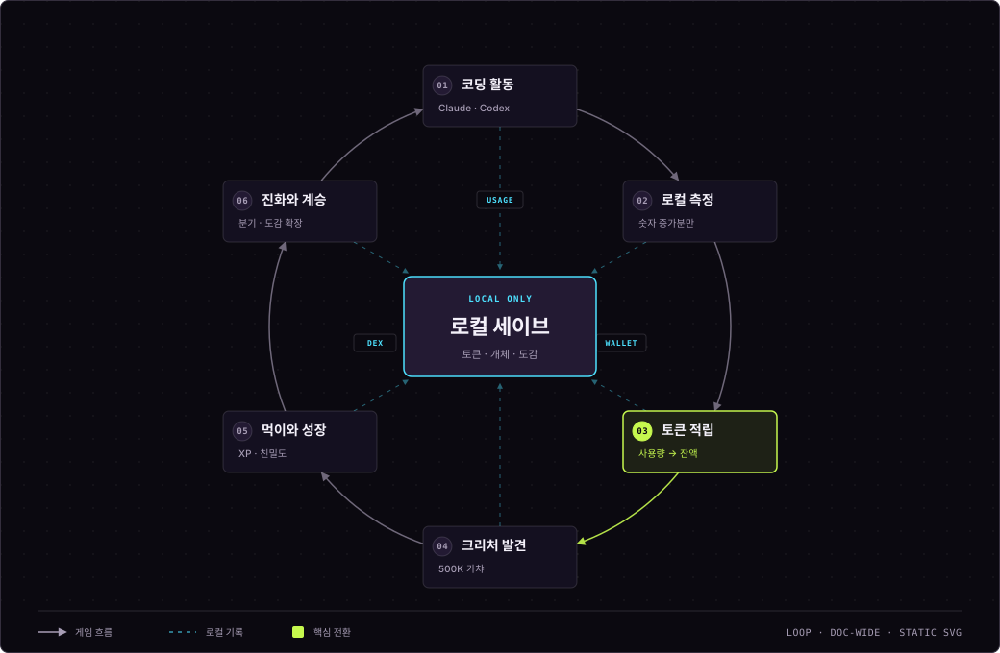

<!-- readme-section:hero -->
<div align="center">
  <h1>PunchGrow</h1>
  <p><strong>코딩이 크리처를 키우는 가장 즐거운 방법</strong></p>
  <p>Claude Code와 Codex 사용량을 성장 에너지로 바꾸는<br />로컬 우선 macOS 크리처 게임입니다.</p>

  <p>
    <a href="README.md"><strong>한국어</strong></a>
    ·
    <a href="README.en.md">English</a>
    ·
    <a href="https://punchgrow.thundo.kr">공식 웹사이트</a>
  </p>

  <p>
    
    
    
    
  </p>

  

  <p>
    <a href="#quick-start"><strong>설치하기</strong></a>
    ·
    <a href="https://punchgrow.thundo.kr/dex/">전체 도감</a>
    ·
    <a href="docs/USAGE.md">사용 가이드</a>
    ·
    <a href="#privacy">개인정보 보호</a>
    ·
    <a href="docs/PROJECT_STRUCTURE.md">저장소 지도</a>
    ·
    <a href="#contributing">기여하기</a>
  </p>
</div>

---

<!-- readme-section:status -->
## 프로젝트 상태

> [!IMPORTANT]
> **v0.4.0 알파 릴리스.** 이 저장소의 공개 대상은 Apple Silicon macOS 14+ 메뉴 막대 앱입니다.

| 릴리스 v0.4.0 | 현재 main |
| --- | --- |
| **2026-08-18 Homebrew 릴리스**<br />64개 시작 계보 · 256종 · 64개 중 ORIGIN 도달 계보 7개(약 10.9%)<br />ad-hoc 서명 · Developer ID 서명과 Apple 공증 예정 | **현재 소스·공개 도감**<br />64개 시작 계보 · 256종 · 64개 중 ORIGIN 도달 계보 7개(약 10.9%)<br />릴리스와 동일한 카탈로그 |

- **CI:** Full Xcode 환경에서 Swift 테스트, Release 빌드, 256개 크리처 리소스 조립과 ad-hoc 코드서명을 검증합니다.
- **웹사이트:** [`punchgrow.thundo.kr`](https://punchgrow.thundo.kr)은 `website/`에서 GitHub Pages로 배포하는 정적 제품 소개·도감이며, 백엔드나 사용량 수집 기능이 없습니다.

<!-- readme-section:quick-start -->
<a name="quick-start"></a>
## 빠른 시작

### Homebrew로 설치 (권장)

Apple Silicon, macOS 14 이상이 필요합니다.

```bash
brew tap yoonsundo/punchgrow https://github.com/yoonsundo/punchgrow
brew trust yoonsundo/punchgrow
brew install --cask punchgrow
xattr -d com.apple.quarantine /Applications/PunchGrow.app
```

> [!NOTE]
> 배포 바이너리는 Apple 공증 전의 ad-hoc 서명 빌드입니다. 첫 실행 전에 위의 `xattr` 명령으로 격리 속성을 제거하세요.
>
> - **Homebrew 6 이상:** `brew trust` 실행
> - **Homebrew 6 미만:** `brew trust` 생략
> - **`--no-quarantine`:** Homebrew 6에서 제거되어 사용 불가

설치·수집 상태·게임 조작·백업·삭제·개인정보 보호·문제 해결은 [상세 사용 가이드](docs/USAGE.md)에 화면과 함께 정리했습니다.

<!-- readme-section:core-loop -->
<a name="core-loop"></a>
## 핵심 경험

**코딩 → 토큰 적립 → 크리처 발견 → 성장·진화 → 새로운 계보 육성.** 모든 상태는 Mac에만 저장됩니다.

<p align="center">
  <a href="docs/diagrams/punchgrow-growth-loop.svg">
    
  </a>
  <br />
  <sub>세부 라벨은 다이어그램을 누르면 원본 크기로 볼 수 있습니다.</sub>
</p>

### PunchGrow를 만든 이유

PunchGrow는 프롬프트나 코드를 수집하지 않고 숫자형 토큰 사용량을 성장 에너지로 바꿉니다. 구체적인 수집·저장 경계는 아래에서 확인할 수 있습니다.

<!-- readme-section:privacy -->
<a name="privacy"></a>
## 개인정보 보호

macOS 앱은 로컬에서 실행되며 사용자가 명시적으로 활성화하기 전까지 수집 기능이 꺼져 있습니다.

### 로컬에서 읽는 정보

- **Claude Code 사용량:** `~/.claude/projects/**/*.jsonl`에서 탐색합니다.
- **Codex 사용량:** `~/.codex/sessions/**/*.jsonl`에서 탐색합니다.
- **Claude 플랜 사용률:** Claude Code가 남긴 로컬 캐시에서 읽습니다. PunchGrow는 캐시 갱신을 위해 Claude Code의 상태줄 스크립트만 실행합니다.
- **Codex 플랜 사용률:** 로그의 한도 메타데이터에서 읽습니다.
- **인증 정보:** PunchGrow는 인증 토큰을 읽거나 저장하지 않습니다.
- **최초 스캔:** 토큰을 지급하지 않는 기준선을 만들며, 이후 증가분만 게임 토큰으로 적립합니다.

### 로컬에 저장하는 정보

- **저장:** 정규화된 토큰 수, 시각, 불투명 해시, 증분 커서와 게임 상태만 저장합니다.
- **저장하지 않음:** 프롬프트, 응답, 소스 코드, 명령어, 프로젝트명, 원본 경로, 이메일, 계정·모델 식별자는 저장하지 않습니다.
- **연결 해제:** PunchGrow 캐시를 삭제해도 원본 Claude Code·Codex 로그는 수정하거나 삭제하지 않습니다.

### 네트워크 경계

- **PunchGrow 업데이트 확인:** GitHub 공개 릴리스 태그를 비교하는, PunchGrow가 직접 보내는 유일한 네트워크 요청입니다. 인증하지 않으며 사용량 수치나 게임 상태를 보내지 않습니다.
- **확인 주기:** 성공하면 하루 뒤 다시 확인합니다. 실패하면 1분부터 최대 하루까지 간격을 늘려 재시도합니다. `설정 → Data & Settings → 업데이트`에서 언제든 끌 수 있습니다.
- **Claude 상태줄 갱신:** 자동 수집 중에는 약 1분마다 Claude Code 상태줄 스크립트를 실행합니다. 이 스크립트가 자체 자격 증명으로 공급자에 사용률을 조회하며, PunchGrow는 해당 자격 증명을 읽지 않습니다. 수집을 끄면 실행도 멈춥니다.

자세한 수집 방식과 상태 모델은 [macOS 문서](macos/README.md)를 참고하세요.

<!-- readme-section:screens -->
<a name="live-systems"></a>
## 실제 앱 화면

아래 이미지는 현재 앱의 SwiftUI 화면을 그대로 렌더링한 캡처입니다. 문서 전용 고정 샘플 데이터를 사용하며 사용자의 실제 로그·프롬프트·소스 코드는 포함하지 않습니다.

<p align="center">
  
</p>

<table>
  <tr>
    <td align="center"><br /><strong>등급표</strong><br /><sub>직접 가챠와 최대 도달 등급을 분리해 표시</sub></td>
    <td align="center"><br /><strong>진화도감</strong><br /><sub>과거·현재·미래 단계를 구분하고 합성 수집품은 현재 모습만 표시</sub></td>
  </tr>
</table>

[전체 사용 가이드 보기 →](docs/USAGE.md)

<!-- readme-section:game-rules -->
<a name="game-engine"></a>
## 게임 규칙

| 규칙 | 알파 기준 |
| --- | --- |
| 가챠 1회 | `500,000` 토큰 |
| 가챠 결과 | 64종 PROCESS 시작형 중 하나 · PROCESS 100% |
| ORIGIN 계보 | 64개 중 7개 · 최대 도달 등급 약 10.9% (직접 ORIGIN 뽑기 아님) |
| 일반 먹이 | 구매 `100,000` 토큰 · XP `+25` · 친밀도 `+3` |
| 대형 먹이 | 구매 `500,000` 토큰 · XP `+200` · 친밀도 `+10` |
| 유니크 컬러 | 매 가챠 `0.1%`, 능력 차이 없음 |
| 중복 크리처 | 자동 분해 없이 별도 개체로 보유하고 서로 다르게 육성 가능 |
| 진화 레벨 | Lv.15 → 2단계 · Lv.25 → 3단계 · Lv.40 → 4단계 |
| 진화 갈림길 | 각 갈림길마다 1회 · 2지선다 직접 선택, 선택할 때까지 진화 대기 |
| 합성 수집품 | `mixed` 10종은 일반 진화에서 제외 · 기존 보유 합성종은 현재 모습만 유지 |
| 변이 발동 | 갈림길 진화 순간 `10%` 확률 · 수락하면 종착, 거절하면 원래 선택되거나 자동 결정된 대상으로 진화 |
| 변이 재도전 | 회당 `1,000,000` 토큰 · `10%` 확률, 계보당 `30`회 실패 시 다음 도전에서 확정 |
| 계승 | `5,000,000` 토큰 · 최종 단계 개체로 같은 시작종 새 개체 획득 |
| 만렙 | Lv.50. 기존 Lv.51~100 저장은 유지되지만 더 오르지 않음 |

### 성장과 진화

- **가챠와 등급:** 고등급 진화체를 직접 뽑지 않습니다. 모든 개체는 PROCESS로 시작하며 먹이로 레벨을 올려 성장합니다. 카드는 실제 상태인 `현재 <등급>`과, 변이를 제외하고 선택 가능한 경로 기준 상한인 `최대 도달 등급 <등급>`을 분리해 보여주며 최소 보장 등급도 함께 표시합니다.
- **진화 갈림길:** Lv.15 또는 Lv.25에서 2지선다로 진화 방향을 직접 고릅니다. 갈림길에 도달하면 진화가 멈추고 배지로 선택을 요청하며, 고른 방향은 해당 진화에만 적용되어 다음 갈림길에서 다시 묻습니다.
- **합성 수집품:** 서로 관련 없는 계열을 합친 `mixed` 10종은 일반 진화, 갈림길, 성장 잠재력 계산과 진화도감 계보에서 제외됩니다. 기존 저장의 합성종은 안전하게 유지되며 실제 현재 모습만 표시합니다.
- **변이:** 후보 계보는 Lv.15 진화 순간마다 10% 확률로 수락·거절을 묻습니다. 수락하면 변이체로 종착하고, 거절하면 발동 전에 사용자가 선택했거나 시스템이 자동으로 정한 원래 대상으로 진화가 이어집니다. `변이 재도전`은 회당 1,000,000 토큰, 성공 확률 10%이며 같은 계보에서 30회 연속 실패하면 다음 도전에서 확정 발동합니다.
- **계승:** 최종 단계 개체에서 5,000,000 토큰으로 같은 시작종의 새 개체를 얻어 다른 갈림길을 재육성할 수 있습니다. ORIGIN 계보를 뽑아도 현재는 PROCESS이며, ORIGIN 전용 공개는 실제 ORIGIN 종을 보유했을 때에만 적용됩니다. 다음 단계 데이터가 없는 계보는 현재 모습으로 계속 성장합니다.

<!-- readme-section:creatures -->
<a name="creature-signal"></a>
## 크리처 세계

### 4원소 원초 계보

물·불·바람·흙을 상징하는 네 계보는 각각 `PROCESS → AGENT → DAEMON → ORIGIN`으로 성장합니다. 기존 도감의 규칙을 따르면서도, 최종형에는 네 원소가 공유하는 원초 문장을 부여해 특별한 존재감을 만들었습니다.

<table>
  <tr>
    <td align="center"><br /><strong>네르바실</strong><br /><sub>물 · 기억을 보존하는 첫 번째 물결</sub></td>
    <td align="center"><br /><strong>카르마그</strong><br /><sub>불 · 가능성을 현실로 미는 최초의 의지</sub></td>
    <td align="center"><br /><strong>벨라움</strong><br /><sub>바람 · 첫 숨과 길을 만든 사방의 지배자</sub></td>
    <td align="center"><br /><strong>그란도르</strong><br /><sub>흙 · 세계를 지탱하는 최초의 기반</sub></td>
  </tr>
</table>

[4원소 계보의 전체 설정과 디자인 원칙 보기 →](문서/ELEMENTAL_ORIGINS.md) · [256종 공개 도감 보기 →](https://punchgrow.thundo.kr/dex/)

### 대표 크리처

<table>
  <tr>
    <td align="center"><br /><strong>에일루</strong><br /><sub>PROCESS · PG-001</sub></td>
    <td align="center"><br /><strong>리토니온</strong><br /><sub>AGENT · PG-102</sub></td>
    <td align="center"><br /><strong>마젤론라크</strong><br /><sub>DAEMON · PG-109</sub></td>
  </tr>
  <tr>
    <td align="center"><br /><strong>퀴논</strong><br /><sub>ORACLE · PG-193</sub></td>
    <td align="center"><br /><strong>자르펜라크</strong><br /><sub>ARCHITECT · PG-166</sub></td>
    <td align="center"><br /><strong>피티온</strong><br /><sub>ORIGIN · PG-211</sub></td>
  </tr>
</table>

> [!CAUTION]
> 대표 6종을 포함한 크리처 아트워크에는 MIT가 아닌 별도의 [시각 자산 라이선스](ASSET-LICENSE.md)가 적용됩니다.

<!-- readme-section:actual-plan-usage -->
<a name="usage-signal"></a>
## 실제 플랜 사용률

메뉴 막대의 `C n%`와 `X n%`는 토큰량으로 추정한 값이 아닙니다.

| 신호 | 실제 데이터 원본 |
| --- | --- |
| `C` | Claude의 실제 주간 사용률을 `~/.claude/plugins/oh-my-claudecode/.usage-cache-anthropic.json` 캐시에서 읽습니다. 이 캐시는 Claude Code만 갱신하므로 PunchGrow가 60초마다 Claude Code의 상태줄 스크립트를 실행해 값이 오래되지 않게 합니다. 캐시가 없으면 `확인 대기`로 남습니다. |
| `X` | Codex 세션 로그의 실제 주간 `used_percent`를 읽습니다. |

- 자동 수집이 켜져 있으면 약 10초 간격으로 확인합니다.
- 공급자가 새 값을 기록하면 사용 증가와 주간 초기화를 자동 반영합니다.
- 값이 없으면 임의로 `0%`를 표시하지 않고 `확인 대기`로 표시합니다.

<!-- readme-section:walkthrough -->
<a name="first-run"></a>
## 5분 사용 순서

1. 앱을 실행하면 Dock이 아니라 macOS 메뉴 막대에 PunchGrow 크리처가 나타납니다.
2. 메뉴 막대 아이콘을 눌러 팝업을 열고, 하단 `설정`에서 큰 창을 연 다음 사이드바의 `Connections`로 이동합니다.
3. `수집 동의 및 시작`을 누르면 Claude Code·Codex 로컬 로그의 숫자형 사용량만 약 10초 간격으로 확인합니다.
4. 첫 스캔은 기존 기록을 소급 지급하지 않는 기준선입니다. 이후 새 사용량부터 보유 토큰에 반영됩니다.
5. 토큰으로 먹이를 구매하거나 가챠를 실행하고, `등급표`와 `진화`에서 성장 가능성을 확인합니다.

<!-- readme-section:repository -->
<a name="source-map"></a>
## 저장소 구성

| 영역 | 상태 | 용도 |
| --- | --- | --- |
| `macos/` | v0.4.0 | Apple Silicon macOS 14+용 네이티브 SwiftUI 메뉴 막대 게임 |
| `website/` | 공개 운영 | GitHub Pages 홈페이지와 한국어·영어 256종 도감 |
| `app/`, `components/`, `src/mobile/` | 탐색 유지 | Expo Router 모바일 프로토타입과 공유 도메인 로직 |
| `web/`, `server/` | 로컬 MVP | Docker Compose로만 실행하는 웹·PostgreSQL 실험 환경. 공개 홈페이지가 아닙니다. |
| `docs/` | 공개 문서 | 사용 가이드, 저장소 구조, 재현 가능한 QA 자료 |
| `문서/` | 제품 원장 | PRD, 결정 기록, 용어집, 와이어프레임과 크리처 디자인 원칙 |
| `production/`, `scripts/` | 검증 기반 | 정본 카탈로그, 공개 증거와 재현·검증 도구 |

[작업별 시작 폴더와 의존 관계를 포함한 저장소 구조 지도 →](docs/PROJECT_STRUCTURE.md)

<details>
<summary><strong>현재 포함된 게임 기능</strong></summary>

- **카탈로그:** 64종 시작형 가챠, 256종 도감, 일반 진화와 분리된 합성 수집품 10종
- **성장:** Lv.15·25·40 진화, 갈림길 선택, 변이, 계승과 6단계 등급(`PROCESS` → `ORIGIN`)
- **육성:** 유니크 컬러, 먹이 주기, 로컬 저장·복원, 구매·급여 버튼을 놓을 때까지 가속 연속 실행
- **등급 표시:** 현재 등급과 최대 도달 등급, 직접 가챠 확률, 계보 비율과 보유·발견·전체 수를 분리 표시
- **진화도감:** 선택한 크리처의 시작형부터 최종형까지 이미지·등급·분기를 보여줍니다. 실제로 거친 과거 단계는 `보유`로 표시되어 메인 이미지로 미리 보거나 외형으로 고정할 수 있고, 미래 단계와 선택하지 않은 분기는 `미보유`로 잠깁니다.
- **화면 효과:** `도감`과 `설정`은 큰 화면으로 열리며, 높은 단계일수록 배지·테두리·오라가 강화됩니다.

</details>

<!-- readme-section:source-build -->
<a name="source-build"></a>
## 소스에서 빌드

Apple Silicon, macOS 14 이상, 버전이 일치하는 Full Xcode와 Command Line Tools가 필요합니다.

처음 받는 사용자는 GitHub 저장소 화면에서 **Code → Download ZIP**을 선택해 압축을 푼 뒤, 터미널에서 압축을 푼 폴더의 `macos` 디렉터리로 이동하세요. 자세한 초보자 순서는 [사용 가이드](docs/USAGE.md)에 있습니다.

```bash
cd macos
./scripts/build-app.sh
open .build/PunchGrow.app
```

현재 `main`에서 생성한 앱은 256종 카탈로그와 로컬 실행용 ad-hoc 서명을 사용합니다. Developer ID 서명과 Apple 공증은 별도의 릴리스 계정 작업으로 남아 있으며, 완료되면 격리 해제(`xattr`) 단계 없이 설치할 수 있게 됩니다.

<!-- readme-section:verification -->
<a name="verification"></a>
## 검증

수정한 영역에 맞는 검사를 실행하세요.

```bash
cd macos
swift test
swift build -c release
./scripts/build-app.sh

cd ../website
npm test
```

일부 macOS 검사는 호환되는 Apple SDK가 설치된 환경을 요구합니다. 크리처 검증 명령은 저장소에 포함된 실행용 자산 팩을 검사하며, 원본 아트와 생성 이력은 의도적으로 Git에서 제외합니다.

<!-- readme-section:contributing -->
<a name="contributing"></a>
## 기여하기

이슈와 범위가 명확한 풀 리퀘스트를 환영합니다. 오픈소스 기여가 처음이라면 포크부터 풀 리퀘스트까지 전체 순서를 담은 [기여 가이드](CONTRIBUTING.md)를 먼저 읽어주세요. 풀 리퀘스트를 열기 전에 다음 사항을 확인해 주세요.

1. [macOS 상세 문서](macos/README.md)에서 수집·개인정보 경계를 확인하세요.
2. 프롬프트, 응답, 소스 코드, 명령어, 원본 경로, 이메일이나 계정 식별자를 수집하는 기능을 추가하지 마세요.
3. 동작 변경에는 테스트를 추가하거나 갱신하고 위의 관련 검증 명령을 실행하세요.

일반적인 도움은 [지원 안내](SUPPORT.md), 보안 또는 개인정보 관련 취약점은 [보안 정책](SECURITY.md)의 비공개 제보 경로를 이용해 주세요.

<!-- readme-section:licenses -->
<a name="license-boundary"></a>
## 라이선스와 아트워크

<p>
  
  
</p>

- **소스 코드:** [MIT 라이선스](LICENSE)로 공개합니다.
- **시각 자산:** 크리처 이미지와 기타 아트워크에는 MIT 라이선스가 적용되지 않습니다. 로컬 실행·평가·기여 목적으로만 제공합니다.
- **기여용 포크:** 원본 저장소에 풀 리퀘스트를 제안하는 포크는 아트워크를 그대로 둘 수 있습니다.
- **그 외 재배포:** 별도 서면 허가가 없다면 보호 대상 아트워크를 제거하거나 교체해야 합니다. 자세한 조건은 [ASSET-LICENSE.md](ASSET-LICENSE.md)를 확인하세요.
- **외부 출처:** [ATTRIBUTIONS.md](ATTRIBUTIONS.md)에 기록되어 있습니다.

<!-- readme-section:acknowledgement -->
## 감사의 말

PunchGrow의 로컬 사용량 탐색 방식은 [PokeTokenBar](https://github.com/chattymin/PokeTokenBar)에서 영감을 받았습니다. PunchGrow는 독립적으로 구현했으며 포켓몬 이름, 스프라이트 또는 아트워크를 포함하지 않습니다.
