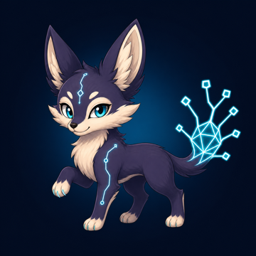
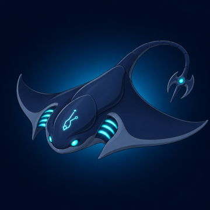
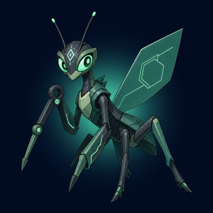
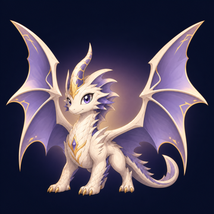

<div align="center">
  

  <h1>PunchGrow</h1>

  <p><strong>코딩이 크리처를 키우는 가장 즐거운 방법</strong></p>
  <p>Claude Code와 Codex 사용량으로 토큰을 얻고,<br />크리처를 부화·육성하며 240종 도감을 완성하세요.</p>

  <p>
    <a href="README.md"><strong>한국어</strong></a>
    ·
    <a href="README.en.md">English</a>
  </p>

  <p>
    
    
    
    
  </p>

  <p>
    <a href="#빠른-시작">빠른 시작</a>
    ·
    <a href="macos/README.md">macOS 상세 문서</a>
    ·
    <a href="#개인정보-보호-구조">개인정보 보호</a>
    ·
    <a href="#기여하기">기여하기</a>
  </p>
</div>

---

> **프로젝트 상태: v0.1.1 알파.** 이 공개 저장소는 Apple Silicon macOS 14+ 메뉴 막대 앱 전용입니다.

GitHub Actions의 Full Xcode 환경에서 Swift 테스트, Release 빌드, 240개 크리처 리소스 조립과 ad-hoc 코드서명을 검증합니다. Developer ID 서명과 Apple 공증을 마친 공개 Homebrew 바이너리는 별도의 릴리스 단계입니다.

## 핵심 경험

| 코딩 | 수집 | 성장 | 개인정보 보호 |
| --- | --- | --- | --- |
| Claude Code·Codex 사용량이 게임 토큰으로 쌓입니다. | 6단계 등급과 240종 크리처를 발견합니다. | 먹이, 진화와 유니크 컬러로 나만의 도감을 만듭니다. | 프롬프트와 코드는 수집하지 않고 Mac 안에서 처리합니다. |

## 대표 크리처

<table>
  <tr>
    <td align="center"><br /><strong>에일루</strong><br /><sub>PROCESS · PG-001</sub></td>
    <td align="center"><br /><strong>리토니온</strong><br /><sub>AGENT · PG-102</sub></td>
    <td align="center"><br /><strong>마젤론라크</strong><br /><sub>DAEMON · PG-109</sub></td>
  </tr>
  <tr>
    <td align="center"><br /><strong>퀴논</strong><br /><sub>ORACLE · PG-193</sub></td>
    <td align="center"><br /><strong>자르펜라크</strong><br /><sub>ARCHITECT · PG-166</sub></td>
    <td align="center"><br /><strong>피티온</strong><br /><sub>ORIGIN · PG-211</sub></td>
  </tr>
</table>

> 대표 6종을 포함한 크리처 아트워크에는 별도의 [시각 자산 라이선스](ASSET-LICENSE.md)가 적용됩니다.

## 게임 규칙

| 규칙 | 알파 기준 |
| --- | --- |
| 가챠 1회 | `500,000` 토큰 |
| 가챠 결과 | 60종의 1단계 크리처 중 하나 |
| 일반 먹이 | 구매 `100,000` 토큰 · XP `+25` · 친밀도 `+3` |
| 대형 먹이 | 구매 `500,000` 토큰 · XP `+200` · 친밀도 `+10` |
| 유니크 컬러 | 매 가챠 `0.1%`, 능력 차이 없음 |
| 중복 크리처 | 자동 분해 없이 별도 개체로 보유하고 서로 다르게 육성 가능 |
| 자동 진화 | Lv.15 → 2단계 · Lv.25 → 3단계 · Lv.40 → 4단계 |
| 만렙 | Lv.50. 기존 Lv.51~100 저장은 유지되지만 더 오르지 않음 |

### 성장과 진화

가챠에서는 고등급 진화체를 직접 뽑지 않습니다. 모든 개체는 1단계에서 시작하며 먹이로 레벨을 올리면 카탈로그 계보에 따라 자동 진화합니다. 계보에 다음 단계 데이터가 없는 경우 현재 모습으로 계속 성장합니다.

## PunchGrow를 만든 이유

AI 코딩에는 토큰 사용량이라는 유용한 활동 신호가 이미 존재합니다. PunchGrow는 실제 작업 내용을 수집하지 않으면서 이 신호를 놀이로 바꿉니다. 로컬 수집기는 숫자형 사용량만 다루며 프롬프트, 응답, 소스 코드, 명령어, 프로젝트명, 계정 식별자와 원본 파일 경로는 게임 데이터 모델에 포함하지 않습니다.

## 저장소 구성

| 영역 | 상태 | 용도 |
| --- | --- | --- |
| `macos/` | v0.1.1 | Apple Silicon macOS 14+용 네이티브 SwiftUI 메뉴 막대 게임 |

현재 게임에는 60종 시작형 가챠, Lv.15·25·40 자동 진화, 6단계 진화 등급(`PROCESS` → `ORIGIN`), 유니크 컬러, 먹이 주기, 로컬 저장·복원과 240종 크리처 도감이 포함되어 있습니다.

macOS 팝업에서는 일반·대형 먹이의 구매와 급여 버튼을 길게 눌러 가속 연속 실행할 수 있습니다. `진화 단계`에서 15·25·40 레벨 기준과 현재 진행을 확인할 수 있으며, 높은 단계일수록 배지·테두리·오라 효과가 강화됩니다.

### 실제 플랜 사용률

메뉴 막대의 `C n%`와 `X n%`는 토큰량으로 추정한 값이 아닙니다.

- `C`: Claude 로컬 OAuth 사용량 캐시의 실제 주간 사용률
- `X`: Codex 세션 로그의 실제 주간 `used_percent`
- 자동 수집이 켜져 있으면 약 10초 간격으로 확인합니다.
- 공급자가 새 값을 기록하면 사용 증가와 주간 초기화를 자동 반영합니다.
- 값이 없으면 임의로 `0%`를 표시하지 않고 `확인 대기`로 표시합니다.

## 개인정보 보호 구조

macOS 앱은 로컬에서 실행되며 사용자가 명시적으로 활성화하기 전까지 수집 기능이 꺼져 있습니다.

- Claude Code 사용량은 `~/.claude/projects/**/*.jsonl`에서 탐색합니다.
- Codex 사용량은 `~/.codex/sessions/**/*.jsonl`에서 탐색합니다.
- 플랜 사용률은 Claude의 로컬 사용량 캐시와 Codex 로그의 한도 메타데이터에서 읽으며 인증 토큰은 저장하지 않습니다.
- 최초 스캔은 토큰을 지급하지 않는 기준선을 만들며, 이후 증가분만 게임 토큰으로 적립합니다.
- PunchGrow는 정규화된 토큰 수, 시각, 불투명 해시, 증분 커서와 게임 상태만 저장합니다.
- 프롬프트, 응답, 소스 코드, 명령어, 프로젝트명, 원본 경로, 이메일, 계정·모델 식별자는 저장하지 않습니다.
- PunchGrow 연결을 해제하고 캐시를 삭제해도 원본 Claude Code·Codex 로그는 수정하거나 삭제하지 않습니다.

자세한 수집 방식과 상태 모델은 [macOS 문서](macos/README.md)를 참고하세요.

## 빠른 시작

### macOS 메뉴 막대 앱

Apple Silicon, macOS 14 이상, 버전이 일치하는 Full Xcode와 Command Line Tools가 필요합니다.

```bash
cd macos
swift test
swift build -c release
./scripts/build-app.sh
open .build/PunchGrow.app
```

생성된 앱은 로컬 실행용 ad-hoc 서명을 사용합니다. Developer ID 서명, 공증과 공개 Homebrew Cask는 별도의 릴리스 계정 작업입니다.

## 검증

수정한 영역에 맞는 검사를 실행하세요.

```bash
cd macos
swift test
swift build -c release
./scripts/build-app.sh
```

일부 macOS 검사는 호환되는 Apple SDK가 설치된 환경을 요구합니다. 크리처 검증 명령은 저장소에 포함된 실행용 자산 팩을 검사하며, 원본 아트와 생성 이력은 의도적으로 Git에서 제외합니다.

## 기여하기

이슈와 범위가 명확한 풀 리퀘스트를 환영합니다. 풀 리퀘스트를 열기 전에 다음 사항을 확인해 주세요.

1. [macOS 상세 문서](macos/README.md)에서 수집·개인정보 경계를 확인하세요.
2. 프롬프트, 응답, 소스 코드, 명령어, 원본 경로, 이메일이나 계정 식별자를 수집하는 기능을 추가하지 마세요.
3. 동작 변경에는 테스트를 추가하거나 갱신하고 위의 관련 검증 명령을 실행하세요.

보안 또는 개인정보 관련 취약점은 공개 이슈 대신 저장소 소유자에게 비공개로 제보해 주세요.

## 라이선스와 아트워크

소스 코드는 [MIT 라이선스](LICENSE)로 공개합니다.

크리처 이미지와 기타 시각 자산에는 MIT 라이선스가 **적용되지 않습니다**. 해당 자산은 PunchGrow를 로컬에서 실행·평가·기여하기 위한 용도로만 제공합니다. 별도 서면 허가가 없는 공개 포크는 보호 대상 아트워크를 제거하거나 교체해야 합니다. 포크를 재배포하기 전에 반드시 [ASSET-LICENSE.md](ASSET-LICENSE.md)를 읽어주세요.

외부 프로젝트와 자산의 출처는 [ATTRIBUTIONS.md](ATTRIBUTIONS.md)에 기록되어 있습니다.

## 감사의 말

PunchGrow의 로컬 사용량 탐색 방식은 [PokeTokenBar](https://github.com/chattymin/PokeTokenBar)에서 영감을 받았습니다. PunchGrow는 독립적으로 구현했으며 포켓몬 이름, 스프라이트 또는 아트워크를 포함하지 않습니다.
