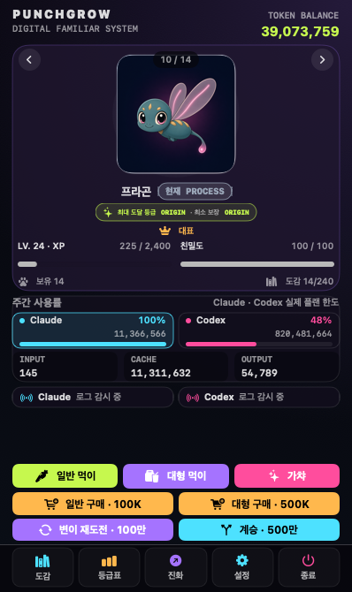
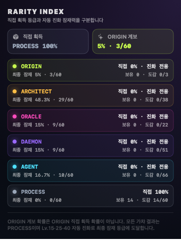
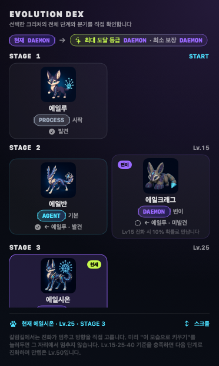

# PunchGrow 사용 가이드

[한국어](USAGE.md) · [English](USAGE.en.md) · [프로젝트 README](../README.md)

> **대상:** Homebrew v0.4.0 배포본과 현재 `main` 소스 · Apple Silicon Mac · macOS 14 이상

PunchGrow는 Claude Code와 Codex의 **로컬 사용량 숫자**를 게임 토큰으로 바꾸어 크리처를 수집하고 성장시키는 메뉴 막대 앱입니다. 앱을 실행하면 Dock이 아니라 화면 오른쪽 위 메뉴 막대에 나타납니다.



> 이 문서의 화면은 현재 `main` 앱이 직접 렌더링한 실제 SwiftUI 화면입니다. 재현 가능한 문서용 샘플 데이터를 사용했으며, 사용자의 로그나 개인 데이터는 포함하지 않습니다.

## 설치 전에 확인하세요

- Apple Silicon(M1 이상) Mac
- macOS 14 Sonoma 이상
- 소스 빌드 시 Full Xcode와 Command Line Tools
- Claude Code 또는 Codex의 로컬 사용 기록은 선택 사항입니다. 수집을 켜지 않아도 앱과 기본 게임은 실행할 수 있습니다.

### 현재 설치 방식

Homebrew로 설치하는 방법과 소스에서 직접 빌드하는 방법이 있습니다.

Homebrew 설치는 터미널에서 아래 네 줄을 순서대로 실행합니다.

```bash
brew tap yoonsundo/punchgrow https://github.com/yoonsundo/punchgrow
brew trust yoonsundo/punchgrow
brew install --cask punchgrow
xattr -d com.apple.quarantine /Applications/PunchGrow.app
```

Homebrew v0.4.0 배포본에는 현재 `main` 소스와 공개 도감에 있는 64개 시작 계보·256종 전체가 들어 있습니다. 배포 바이너리는 아직 Apple 공증 전의 ad-hoc 서명 빌드입니다. macOS는 인터넷에서 받은 앱에 격리(quarantine) 속성을 붙여 실행을 차단하므로, 마지막 `xattr` 명령으로 그 속성을 제거해야 앱이 실행됩니다. Homebrew 6 미만 버전은 `brew trust` 명령이 없으므로 그 줄을 건너뜁니다. 과거 안내의 `brew install --cask --no-quarantine` 옵션은 Homebrew 6에서 제거되어 `Error: invalid option`이 발생하니 사용하지 마세요.

## 소스에서 빌드하고 실행하기

GitHub 저장소 화면에서 **Code → Download ZIP**을 선택해 압축을 풉니다. 터미널을 열고 `cd `를 입력한 다음, Finder에서 압축을 푼 폴더 안의 `macos` 폴더를 터미널로 끌어다 놓고 Return을 누르면 경로가 자동으로 입력됩니다. Git을 알고 있다면 저장소를 clone한 뒤 같은 `macos` 폴더로 이동해도 됩니다.

`macos` 폴더로 이동한 터미널에서 다음 순서로 실행합니다.

```bash
xcode-select -p
xcodebuild -version
swift --version
./scripts/build-app.sh
open .build/PunchGrow.app
```

`build-app.sh`는 Release 실행 파일과 256개 크리처 이미지를 확인하고, 로컬 실행용 ad-hoc 서명을 적용한 `.build/PunchGrow.app`을 만듭니다.

`xcodebuild`가 없거나 Swift와 SDK 버전이 맞지 않으면 Full Xcode를 설치하고 Command Line Tools가 같은 Xcode를 가리키도록 설정한 뒤 다시 빌드하세요. Developer ID 서명과 Apple 공증은 공개 바이너리 배포 단계이며, 소스에서 직접 만든 로컬 앱에는 포함되지 않습니다.

개발 검증이 필요하면 버전이 일치하는 Full Xcode 환경에서 실행합니다.

```bash
cd punchgrow/macos
swift test
swift build -c release
```

## 처음 실행하기

1. `.build/PunchGrow.app`을 실행합니다.
2. Dock 아이콘 대신 메뉴 막대에서 **크리처 아이콘 · `C n%` · `X n%`** 표시를 찾습니다.
3. 표시를 클릭하면 작은 게임 화면이 열립니다.
4. 하단의 **설정**을 눌러 큰 창을 열고, 왼쪽 사이드바에서 **Connections**로 이동합니다.
5. **수집 동의 및 시작**을 누르면 약 10초 간격으로 로컬 사용량 변화를 확인합니다.

한 번 동의하면 다음 실행 때 자동 수집이 다시 시작됩니다. 처음 켠 직후의 기존 기록은 **기준선**으로만 등록됩니다. 이번 주 통계에는 보일 수 있지만 과거 사용량을 한꺼번에 게임 토큰으로 지급하지 않으며, 이후 새로 증가한 사용량부터 보유 토큰에 반영합니다.

### 연결 상태 읽기

| 상태 | 의미 |
| --- | --- |
| `중지됨` | 자동 수집이 꺼져 있습니다. |
| `로그 감시 중` | 정상적으로 로컬 폴더를 감시 중이며, 최근 10초 안에 새 적립이 없었습니다. 오류가 아닙니다. |
| `방금 수신` | 기준선 이후의 새 사용량을 확인해 게임 토큰에 반영했습니다. 약 10초 뒤 다시 `로그 감시 중`으로 돌아갑니다. |
| `확인 필요` | 로그 또는 로컬 캐시를 안전하게 읽거나 저장하지 못했습니다. 화면의 안내를 확인하세요. |

Claude Code는 `~/.claude/projects`, Codex는 `~/.codex/sessions` 아래의 로컬 기록을 탐색합니다. 두 도구를 PunchGrow 안에서 따로 실행할 필요는 없습니다.

## 화면의 숫자 이해하기

서로 다른 세 가지 숫자를 구분하면 됩니다.

- **TOKEN BALANCE / 보유 토큰:** 가챠와 먹이 구매에 실제로 쓸 수 있는 게임 재화입니다.
- **`C n%`:** Claude의 실제 주간 플랜 한도 사용률입니다. `~/.claude/plugins/oh-my-claudecode/.usage-cache-anthropic.json` 캐시에서 읽으며, 그 캐시는 Claude Code만 갱신하므로 PunchGrow가 60초마다 Claude Code의 상태줄 스크립트를 실행해 값을 최신으로 유지합니다.
- **`X n%`:** Codex의 실제 주간 플랜 한도 사용률입니다.
- **Claude·Codex 행의 토큰 수:** 이번 주 로컬 로그에서 관찰한 사용량입니다. 보유 토큰 잔액과 같은 값이 아닙니다.

주간 한도가 초기화되거나 사용률이 증가하면 공급자가 새 값을 로컬에 기록한 다음 자동 수집 주기에 맞춰 반영됩니다. 값을 아직 확인하지 못했다면 임의의 `0%` 대신 `—` 또는 확인 대기 상태가 표시됩니다.

## 가챠와 먹이

| 동작 | 비용 또는 효과 |
| --- | --- |
| 가챠 1회 · Homebrew v0.4.0 | 500,000 토큰 · 64종 PROCESS 시작형 중 하나 |
| 가챠 1회 · 현재 `main` | 500,000 토큰 · 64종 PROCESS 시작형 중 하나 |
| 일반 먹이 구매 | 100,000 토큰 · 일반 먹이 1개 |
| 일반 먹이 사용 | XP +25 · 친밀도 +3 |
| 대형 먹이 구매 | 500,000 토큰 · 대형 먹이 1개 |
| 대형 먹이 사용 | XP +200 · 친밀도 +10 |

- **가챠**는 한 번 클릭할 때 한 번 실행됩니다.
- 일반·대형 **먹이 주기**와 **구매** 버튼은 한 번 클릭하거나 길게 누를 수 있습니다.
- 길게 누르면 점차 빨라지며 연속 실행되고, 손을 떼면 즉시 멈춥니다.
- 잔액이나 먹이가 부족하거나 현재 크리처가 만렙이면 해당 동작이 중지됩니다. 진화 선택 대기 중인 크리처가 Lv.50에 닿은 경우도, 방향을 고르기 전까지는 만렙과 마찬가지로 추가 급여가 막힙니다.
- 가챠로 새 크리처를 얻으면 그 개체가 현재 조작 대상이 됩니다. 대표 크리처는 **대표로 지정**을 눌렀을 때만 바뀝니다.

## 현재 등급과 최대 도달 등급

가챠 결과는 모두 **PROCESS 시작형**입니다. 카드의 두 배지는 서로 다른 뜻입니다.

- **현재 PROCESS:** 지금 보유한 크리처의 실제 등급
- **최대 도달 등급 ORIGIN:** 변이를 제외하고 선택 가능한 진화 경로를 끝까지 골랐을 때 도달할 수 있는 상한 등급. 함께 표시되는 **최소 보장** 등급은 아직 선택하지 않은 갈림길에서 가장 낮은 경로를 골랐을 때의 하한이라, 상한만 보고 생기는 낙관적 기대를 막아줍니다.

Homebrew v0.4.0 배포본과 현재 `main` 소스는 모두 시작 계보 64개 중 7개가 ORIGIN까지 도달하므로 **7/64, 약 10.9%**입니다. 이는 ORIGIN을 가챠에서 직접 뽑을 확률이 아니며, 실제로 ORIGIN까지 도달하려면 매 갈림길에서 그 방향을 직접 골라야 합니다. ORIGIN 계보를 뽑아도 처음에는 PROCESS이며 직접 성장시켜야 합니다.



하단 **등급표**에서는 직접 가챠 확률과 최대 도달 등급별 계보 비율을 따로 확인할 수 있습니다. `직접 0% · 진화 전용`은 해당 등급을 가챠에서 바로 얻을 수 없다는 뜻입니다.

## 레벨과 진화

- Lv.15: 2단계 진화
- Lv.25: 3단계 진화
- Lv.40: 4단계 진화
- Lv.50: 현재 성장 상한. 도달하는 순간 금색 `LEVEL MAX` 축전이 한 번 뜨고, 만렙 크리처는 메인 카드의 테두리와 레벨 게이지가 금색으로 유지됩니다.

일반 분기·특수 진화 13종은 진화 갈림길(Lv.15 또는 Lv.25, 2지선다)에서 방향을 직접 고릅니다. 갈림길에 닿으면 진화가 멈추고 **진화 선택 대기** 배지가 뜨며, 팝업에서 방향을 고를 때까지 그 상태로 남습니다. 혼합형(`mixed`)은 이 선택지와 자동 진화에 나오지 않습니다. 고른 방향은 그 진화 한 번에만 적용되므로 다음 갈림길이 있다면 다시 묻습니다. 진화도감에서는 이 개체가 실제로 거쳐 온 과거 단계 카드만 눌러 팝업 메인 이미지로 미리 볼 수 있습니다.

변이 후보가 있는 계보는 Lv.15 진화 순간마다 10% 확률로 변이가 발동해 수락/거절을 묻습니다. 수락하면 그 자리에서 변이체(항상 2단계 종착)로 진화가 끝나고, 거절하면 발동 전에 사용자가 선택했거나 시스템이 자동으로 정한 원래 대상으로 진화가 이어집니다. 발동을 놓쳤거나 다시 노려보고 싶다면 **변이 재도전**(회당 1,000,000 토큰, 10% 확률)을 쓸 수 있고, 같은 계보에서 30회 연속 실패하면 다음 도전에서 반드시 발동합니다.

최종 단계까지 키운 개체는 **계승**(5,000,000 토큰)으로 같은 시작종의 새 개체를 얻어 다른 갈림길을 다시 육성할 수 있습니다.

먹이 한 번으로 여러 진화 기준을 한꺼번에 넘으면 가능한 단계까지 연속으로 진화합니다. 단, 그 사이에 변이가 발동하면 그 자리에서 멈추고 수락/거절부터 확인합니다.



하단 **진화**를 누르면 현재 크리처의 시작형부터 최종형까지 볼 수 있습니다. `현재`는 이 개체의 실제 현재 단계, `보유`는 이 개체가 직접 거쳐 온 과거 단계라 클릭 가능한 모습, `미보유` 자물쇠는 아직 도달하지 않았거나 선택하지 않은 분기라 클릭할 수 없는 모습을 뜻합니다. 과거 모습을 미리 보거나 외형으로 고정해도 실제 종·레벨·경험치는 바뀌지 않습니다.

이전 버전의 세이브에 이미 혼합형이 있다면 그대로 보유할 수 있습니다. 이 개체는 일반 진화 계보 밖의 **융합 수집품**으로 표시되며, 진화도감에는 실제 현재 모습 하나만 나오고 부모 단계는 임의로 만들지 않습니다.

## 하단 버튼

| 버튼 | 기능 |
| --- | --- |
| **도감** | 큰 창에서 발견·보유 현황, 검색, 발견한 카드와 미발견 실루엣을 봅니다. |
| **등급표** | 직접 가챠 확률, 최대 도달 등급별 계보 수, 보유·도감 수를 봅니다. |
| **진화** | 현재 크리처의 전체 계보를 보고, 보유한 과거 단계만 눌러 모습을 미리 봅니다. |
| **설정** | 큰 창의 Data & Settings를 열며, 사이드바에서 Connections로 이동할 수 있습니다. |
| **종료** | 자동 수집을 정리하고 PunchGrow를 완전히 종료합니다. |

## 설정, 백업과 복원

**설정 → Data & Settings**에서 알림, 사운드, 빛과 움직임 줄이기를 바꿀 수 있습니다. macOS의 시스템 **동작 줄이기** 설정도 ORIGIN 연출에 반영됩니다.

- **백업 내보내기:** 크리처, 보유 토큰, 진행도와 사용량 수치를 `.pgrow` 파일로 저장합니다.
- **백업 복원:** 기존 `.pgrow` 파일의 게임 상태를 현재 상태로 불러옵니다. 중요한 현재 진행도는 먼저 따로 백업하세요.
- 백업에는 프롬프트, 응답, 소스 코드와 원본 로그가 포함되지 않습니다.

## 새 버전 확인과 알림

PunchGrow는 마지막으로 성공한 확인에서 24시간이 지났을 때 GitHub에 새 버전이 있는지 확인합니다. 앱을 켤 때마다 확인하는 것은 아니어서, 하루 안에 여러 번 실행해도 요청은 한 번뿐입니다. 확인이 실패하면(네트워크가 없거나 응답이 오지 않으면) 1분 뒤부터 간격을 두 배씩 늘리며 최대 하루까지 다시 시도합니다. 이 확인은 공개 릴리스 목록을 읽기만 하는 요청이며, 사용량 수치·게임 상태·프롬프트·코드는 전혀 보내지 않습니다.

새 버전이 있으면 팝업 위쪽에 배너가 나타납니다. `설정 → Data & Settings`의 `알림` 토글이 켜져 있으면 macOS 알림센터로도 한 번 알려주며, 같은 버전을 다시 알리지는 않습니다. 배너와 업데이트 패널에서 다음을 할 수 있습니다.

- `brew upgrade --cask punchgrow` 명령 복사
- 릴리스 노트 열기
- 이 버전 건너뛰기 (더 높은 버전이 나오면 다시 알립니다)

PunchGrow는 새 버전을 스스로 설치하지 않습니다. 안내된 `brew upgrade --cask punchgrow` 명령을 터미널에서 직접 실행해야 설치됩니다. Homebrew 캐스크로 배포되고 있어서, 앱이 스스로 번들을 바꾸면 brew가 아는 버전과 실제 설치된 버전이 어긋나기 때문입니다.

자동 확인을 끄려면 `설정 → Data & Settings → 업데이트`에서 `새 버전 자동 확인` 토글을 끕니다. 같은 곳에 `지금 확인` 버튼과 마지막으로 성공한 확인 시각이 있습니다.

## 수집 중지, 연결 해제와 삭제

### 잠시 수집만 멈추기

**Connections → 수집 중지**를 누릅니다. 자동 확인은 멈추지만 PunchGrow의 증분 캐시는 남아 있으므로 나중에 이어서 수집할 수 있습니다.

### 연결과 수집 캐시 지우기

**Connections → 연결 해제 및 캐시 삭제**를 누릅니다. 수집이 중지되고 PunchGrow가 만든 사용량 캐시와 화면의 관찰 통계가 지워집니다. Claude Code와 Codex의 원본 로그는 수정하거나 삭제하지 않습니다. 다시 연결하면 첫 스캔이 새 기준선을 만듭니다.

### 앱 제거하기

1. 먼저 `.pgrow` 백업을 만듭니다.
2. 팝오버 하단의 **종료**를 누릅니다.
3. 소스 빌드 앱 `punchgrow/macos/.build/PunchGrow.app`을 휴지통으로 옮깁니다.
4. 진행도까지 완전히 지우려면 Finder의 **이동 → 폴더로 이동**에서 `~/Library/Application Support/PunchGrow`를 열어 폴더를 삭제합니다.
5. 알림·사운드·수집 동의 같은 설정까지 지우려면 `~/Library/Preferences/app.punchgrow.menubar.plist`도 삭제합니다.

4~5단계의 데이터 삭제는 되돌릴 수 없으므로 백업을 먼저 확인하세요.

## 개인정보 보호

PunchGrow의 자동 수집은 사용자가 동의한 뒤 이 Mac 안에서만 동작합니다.

- 토큰 수치, 시각, 증분 읽기 위치, 불투명 해시와 플랜 사용률만 처리합니다.
- 프롬프트, 응답, 소스 코드, 명령어, 프로젝트명, 이메일, 계정·모델 식별자와 원본 경로를 게임 상태에 저장하지 않습니다.
- 인증 토큰을 PunchGrow 게임 데이터나 백업에 저장하지 않습니다.
- 원본 Claude Code·Codex 로그를 수정하거나 삭제하지 않습니다.
- `.pgrow` 백업은 사용자가 선택한 로컬 위치에만 생성되며 서버로 자동 전송되지 않습니다.
- 새 버전 확인(GitHub 공개 릴리스 목록 읽기)은 PunchGrow가 직접 보내는 유일한 네트워크 요청입니다. 확인에 성공하면 하루 한 번이고, 실패하면 1분에서 시작해 최대 하루까지 간격을 늘리며 재시도합니다. `설정 → Data & Settings → 업데이트`에서 언제든 끌 수 있습니다.
- 자동 수집이 켜져 있는 동안에는 PunchGrow가 Claude Code의 상태줄 스크립트를 약 1분마다 실행합니다. 사용률 최신값이 그 스크립트를 통해서만 로컬 파일에 기록되기 때문이며, 스크립트는 자신의 자격 증명으로 공급자에 조회합니다. PunchGrow는 그 자격 증명을 읽지 않고, 수집을 끄면 이 실행도 멈춥니다.

## 문제 해결

### 앱을 실행했는데 창이 보이지 않습니다

정상입니다. PunchGrow는 Dock 앱이 아니라 메뉴 막대 앱입니다. 화면 오른쪽 위에서 크리처 아이콘과 `C`·`X` 표시를 찾으세요. 아이콘이 가려졌다면 메뉴 막대의 다른 항목을 줄이거나 앱을 종료 후 다시 실행하세요.

### `C —` 또는 `X —`가 계속 표시됩니다

Connections에서 자동 수집이 실행 중인지 확인하고 Claude Code 또는 Codex를 한 번 사용한 뒤 다음 스캔을 기다리세요. `C —`는 v0.4.0이 읽는 `oh-my-claudecode` 사용량 캐시가 아직 생성되지 않았을 때도 계속 표시될 수 있습니다. `X —`는 Codex가 로컬 세션에 주간 한도 메타데이터를 아직 기록하지 않았을 수 있습니다. 정확한 값이 없으면 PunchGrow는 임의 비율을 만들지 않습니다.

### `로그 감시 중`인데 보유 토큰이 늘지 않습니다

`로그 감시 중`은 정상 연결 상태입니다. 첫 스캔은 과거 사용량을 지급하지 않는 기준선을 만듭니다. 기준선 이후 Claude Code나 Codex의 사용량이 실제로 증가하면 `방금 수신`으로 바뀌고 잔액에 반영됩니다.

### `확인 필요`가 표시됩니다

화면의 안내를 먼저 확인하세요. 로그 폴더 읽기 권한, 디스크 여유 공간, Claude Code·Codex의 로컬 기록 존재 여부를 확인한 뒤 **수집 중지 → 수집 동의 및 시작** 순서로 다시 시작합니다. 계속 실패하면 앱을 종료한 뒤 다시 실행하세요.

### 소스 빌드가 실패합니다

`xcode-select -p`, `xcodebuild -version`, `swift --version` 결과가 서로 호환되는 Full Xcode 설치를 가리키는지 확인하세요. Command Line Tools만 설치되어 있거나 컴파일러와 SDK 버전이 다르면 빌드 또는 테스트가 실패할 수 있습니다.

### 크리처 이미지가 보이지 않습니다

앱을 종료하고 `./scripts/build-app.sh`를 다시 실행하세요. 이 스크립트는 앱을 조립할 때 256개 PNG가 모두 있는지 검사합니다.

### 복원 후 진행도가 예상과 다릅니다

복원은 `.pgrow` 파일의 상태를 현재 게임 상태로 적용합니다. 다른 작업을 하기 전에 오류 메시지를 확인하고, 복원 전 백업이 있다면 그 파일을 다시 선택하세요.
